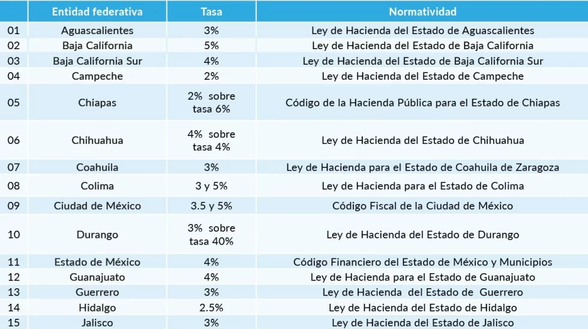

El impuesto al hospedaje es un gravamen de carácter estatal que grava los servicios de hospedaje, de tal forma que es el huésped quien paga el impuesto y el hotelero como retenedor temporal del impuesto para enterarlo a la hacienda estatal. Por lo que la hacienda estatal en cada entidad federativa es la encargada de recaudar este impuesto y establecer las políticas públicas estatales y municipales en temas de inversión para el desarrollo del sector turismo.

Concepto
Gramaticalmente la palabra hospedaje significa “Alojamiento y asistencia” este término adquiere relevancia cuando se acompaña a la palabra contrato. El Código Civil para la Ciudad de México, en el Capítulo V” Del Contrato de Hospedaje” artículo 2666, señala que “El contrato de hospedaje tiene lugar cuando alguno presta a otro albergue, mediante la retribución convenida, comprendiéndose o no, según se estipule, los alimentos y demás gastos que origine el hospedaje”.

La palabra albergar significa brindar abrigo, mientras que alojar simboliza dar aposento. En ambos casos la idea básica consiste en que el dueño de un inmueble le permite a un sujeto con quién no comparte el uso del mismo, permanecer en él un tiempo. Desde el momento en que estos dos términos se reducen a la idea de autorizar a alguien a habitar temporalmente un inmueble, se concluye que el brindar otros servicios accesorios al de alojamiento, no constituye elemento alguno del concepto de hospedaje.

Finalidad
El ISH es el gravamen que se aplica a los hoteles y otros establecimientos que brindan servicios de hospedaje y el cual, para su cumplimiento se traslada a los clientes. Es un impuesto indirecto de carácter estatal y cada entidad federativa se encarga de establecer las tasas de aplicación y realizar la recaudación. Los recursos obtenidos por el pago de este impuesto sirven para impulsar al sector turístico en nuestro país. El ISH tiene un rango de un 2% a 5% en la facturación que los hoteles realizan y únicamente gravando lo correspondiente al hospedaje, sin considerar los servicios adicionales que son prestados en los establecimientos como es el caso de alimentos y bebidas, tintorería, etc.

Dentro de las actividades financieras que le son atribuibles al Estado Mexicano, está el recaudar y administrar los recursos necesarios para poder satisfacer las necesidades colectivas de la sociedad, siendo una de las fuentes principales para la obtención de los ingresos, la imposición de contribuciones que establecen el Congreso de la Unión o las legislaturas de los Estados, y así contribuir para los gastos públicos así de la Federación, Estados y Municipios en que residan de la manera proporcional y equitativa que así lo disponen las leyes respectivas, conforme a lo establecido el artículo 31, fracción IV, de la Constitución Política de los Estados Unidos Mexicanos(CPEUM), por lo que hace a las contribuciones de carácter federal.

En el ámbito estatal, el artículo 115, fracción IV, de la Carta Magna, establece que los municipios administrarán libremente su hacienda, la cual se formará de los rendimientos de los bienes que les pertenezcan, así como de las contribuciones y otros ingresos que las legislaturas establezcan a su favor. En ese sentido, la misma Constitución local les otorga a los Estados la facultad de legislar en materia tributaria, creando para ello su Presupuesto de Egresos, Ley de Ingresos y su Código Financiero.

En ese orden de ideas, las contribuciones estatales que establecen las entidades federativas emanan de su Constitución Estatal y de sus leyes fiscales de cada uno de los estados. Los impuestos Estatales y Municipales son creados por los Congresos Locales y su aplicación será dentro del territorio de la Entidad Federativa y Municipios y varían según el estado donde se tribute.

Las entidades federativas y los municipios establecen las contribuciones que las personas físicas y morales tienen la obligación de contribuir para los gastos públicos conforme lo determina la legislación estatal, el Impuesto por la prestación de Servicios de Hospedaje entre otros impuestos es un impuesto local fundamental en la recaudación, al igual que otros impuestos locales es una de las principales fuentes de recursos propios de las entidades federativas representando en la mayoría de los estados parte de la recaudación total de los impuestos estatales por lo que los estados incorporan este impuesto como parte de su presupuesto de ingresos.

Para los efectos de este impuesto se consideran servicios de hospedaje, la prestación de alojamiento o albergue temporal de personas a cambio de una contraprestación, las entidades federativas están facultadas para gravar la prestación de servicios de hospedaje.

Clasificación
Es un impuesto local, ya que se establece en la legislación local, objetivo o real porque grava una labor y no algún aspecto personal del contribuyente, indirecto toda vez que al trasladarlo a quien recibe el servicio se está gravando el consumo y especial porque el hecho imponible se refiere a una sola actividad y no a varias.

De los elementos esenciales del Impuesto por la prestación de Servicios de Hospedaje referentes a sujeto, objeto, base gravable, época de pago, tasa, cuota o tarifa, en esta ocasión se abordará el porcentaje para el ejercicio 2024.

El Impuesto por la prestación de Servicios de Hospedaje en cada entidad federativa contempla distintas características y peculiaridades de acuerdo a su legislación estatal por lo que es importante consultarlas para conocer a detalle cómo se aplicará el Impuesto y así conocer qué aspectos se deben considerar para su cálculo, fecha de pago, tasa, etc.

A continuación se muestra el cuadro de las entidades federativas con el porcentaje y normatividad del impuesto para el ejercicio fiscal 2024.

