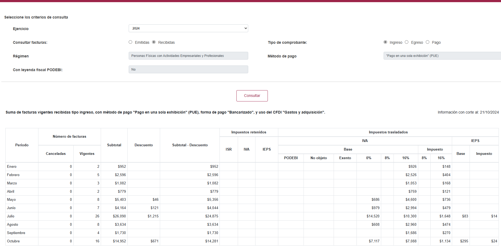

En esta pagina se pueden ver el resumen por mes acumulado por año de las facturas emitidsa y recibidas de un contribuyente

https://www.sat.gob.mx/declaracion/30591/simulador-del-visor-de-facturas-emitidas-y-recibidas

Falta por hacer la guia de uso y ejemplos adoptes a esto.

(Caso de uso)
Investigar para la implementacion y uso para el manejo de clientes.

En esta imagen se muestra el aplicativo

